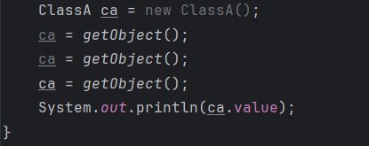

# 面向对象基础练习题

## 题1
C.输出10 20

1. 先调用了无参方法返回了类的value属性，再调用了有参方法，将参数赋值给类的value属性，最后输出了value属性的值。

## 题2
1.  编辑不通过，因为第二个有参方法声明有int类型返回值，但是方法体内无返回语句，运行会出错
2. 要在第二个method方法中加入return语句，返回一个int类型值，否则编译不通过

## 题3
1.  A B D都对，第一个要说明至少一个构造方法，类里可以不写构造方法，系统会默认添加一个无参构造方法，
如果写一个有参，就必须写无参 C错在构造方法没有返回值

## 题4
1. 运行结果：
2. 10
3. 11
4. 因为b是把a的值给了b，跟a本身无关，所以b++后a还是10，而mc2对象是引用指向的mc1在堆中的地址，所以mc2的值自增，
这里的值是实例对象的变量，也就是实例变量那mc1的值也就改变了

## 题5

可以看到在idea里面第一行new ClassA（）和下面两行ca 都是灰色的，说明没有用到，所以不会被调用

1. 这道题结果输出20，这是因为第三行ca = getObject();给这个ca引用对象重新指向了一个新的地址，
即第三次执行getObject（）返回的对象，所以只执行了一次+=10最后输出20; 

## 题6
1. 运行结果：会报错，因为MyClass类中没声明有参的构造方法，就只有默认生成的无参构造方法，
所以传值10会报错，没有这个有参的构造方法
2. 如果要修改，就在类中来一个有参数的构造方法，可以让实例对象调用该构造方法传入10

## 题7
```JAVA
class Dog{
    private String name; //狗名
    private int age; //狗龄
    private boolean sexual; //公狗母狗 true公 false母`
    //构造方法
    public Dog(){}
    public Dog(String name, int age, boolean sexual){
        this.name = name;
        this.age = age;
        this.sexual = sexual;
    }
    public void play(){
        System.out.println(name + "play");
    }
    public void play(int n){
        System.out.println(name + "play" + n + " minutes");
    }   
}
public class TestDog{
    public static void main(String[] args){
        Dog d = new Dog("joy", 2, false);
        d.play();
        d.play(30);
}
```

## 题8
1. ```java
   1. 运行结果：ClassA() ClassC() ClassB()
   
   2. 是因为在实例ClassC这个类时，从上到下执行，初始化的时候先在cc对象里实例化了a，调用A的构造方法输出，
      然后调用C的构造方法，先输出C，又给b指向一个对象，调用B的构造方法输出
   
      //创建对象时先初始化，再调用构造方法
   
   3. 静态成员和static块-->普通成员和非static块-->构造函数 ,最后才执行构造方法
   
   4. 对象的初始化顺序(父类永远在子类前面，属性和方法谁写在上边谁先执行)
   
   5. 可以自己尝试，在classA中写一个输出字符串的方法，在这个类开头先声明一个变量接受这个方法的结果，
      比如String s = getString()当实例化对象的时候初始化的同时就会调用变量后面的方法输出字符串
   ```

   

## 题9

1.答案B，因为调用changeInt（）方法只是将value的值传入方法中赋值使用，处于栈中的栈帧中，当方法进栈执行value++完弹栈后就消失了，参考这个图

2.像数组，作为对象存在堆中，所以用其他对象引用这个数组的地址，改变值后，原数组的元素也发生改变是因为改变的是它在堆中的值。比如我告诉装修工家里的位置，他来我家装修后，我回来发现家里被装修过了；而上面的方法，可以想象为，我告诉你我家里有一瓶可乐，你想喝，我不想让你喝我家的，就去买了一瓶给你，而你喝完，我家可乐还在，我给你买就是买一瓶一样的可乐赋值给你喝。

https://gitee.com/mcmeloxd/image_storage/raw/master/chap05Oop/image-20240523172208331.png

## 题10

这里两行会报错，是因为通过this（属性）调用属性必须放在方法体内第一行,可以把第一行删掉或者将其放在第二行


这里this(name)意思是调用本类中的1个参数的构造方法，传入name

1、构造方法之间要进行相互调用，就一定要使用this。
2、只能编写在构造函数中,不能在普通函数中编写。
3、必须作为方法体的第一行有效代码。

## 题11

```JAVA
String name; // 姓名
int age; // 年龄
double salary; // 工资

// 无参构造方法
public Worker() {
}

// 全参数的
public Worker(String name, int age, double salary) {
    this.name = name;
    this.age = age;
    this.salary = salary;
}

// 无参work方法
public void work() {
    System.out.println(name + "正在打工！");
}

// 有参work方法，表示工作时间
public void work(int hours) {
    System.out.println(name + "已经工作" + hours + "小时！");
}
```

## 题12

```java
 String address; //地址
 String zipCode; //邮编
//无参构造方法
public Address(){
}
//全参数构造方法
public Address(String address,String zipCode){
    this.address = address;
    this.zipCode = zipCode;
}
```

## 题13

```java
public static void main(String[] args) {
    Worker wk = new Worker("zhangsan",25,2500);
    wk.addr = new Address("北京市海淀区清华园1号","100084");
    System.out.println(wk.toString());
}
```

## 题14

选C  

第一步先实例化创建一个ca对象，假设此时它在堆中的地址为b16，首先调用changeValue，赋值100


第二步调用changeRef方法，将ca重新指向新的ClassA对象，新对象的地址为b17，并且赋值200，方法结束，弹栈走人，所以根本就没动我b16 ？？


## 题15

```java
public class Complex {
    double real; // 实部
    double im; // 虚部

    // 有参数构造方法就需要把无参也写出来。。
    public Complex() {
    }

    public Complex(double real, double im) {
        this.real = real;
        this.im = im;
    }

    // 将结果控制到1位小数并且转为字符串输出
    public String toString(Complex c) {
        //String.format是String类提供的格式化方法
        String Sreal = String.format("%.1f", c.real);
        String Sim = String.format("%.1f", c.im);
        String result;
        //为了按格式表达复数，虚部位负数时，加括号 格式：a+bi
        if (c.im < 0) {
            result = Sreal + "+(" + Sim + "i)";
        }else {
            result = Sreal + "+" + Sim + "i";
        }
        return result;
    }

    // 复数加法
    public Complex add(Complex c) {
        Complex result = new Complex();
        result.real = (this.real + c.real);
        result.im = (this.im + c.im);
        return result;
    }

    // 复数减法
    public Complex sub(Complex c) {
        Complex result = new Complex();
        result.real = (this.real - c.real);
        result.im = (this.im - c.im);
        return result;
    }

    // 复数乘法
    public Complex mul(Complex c) {
        Complex result = new Complex();
        result.real = (this.real * c.real) - (this.im * c.im);
        result.im = (this.real * c.im) + (this.im * c.real);
        return result;
    }

    public static void main(String[] args) {
        Complex c1 = new Complex(3, 5);
        Complex c2 = new Complex(4, 6);
        // 创建一个Complex对象接受相加结果
        Complex c3 = c1.add(c2);
        System.out.println("两个复数相加结果为：" +  c3.toString(c3));
        // 创建一个Complex对象接受相减结果
        Complex c4 = c1.sub(c2);
        System.out.println("两个复数相减结果为：" +  c4.toString(c4));
        // 创建一个Complex对象接受相乘结果
        Complex c5 = c1.mul(c2);
        System.out.println("两个复数相乘结果为：" +  c5.toString(c5));
    }
}
```